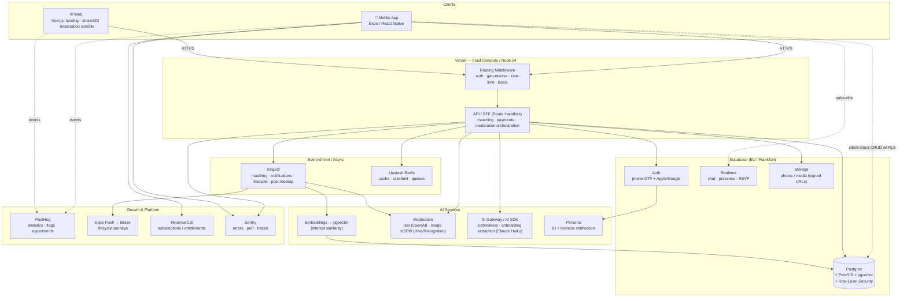
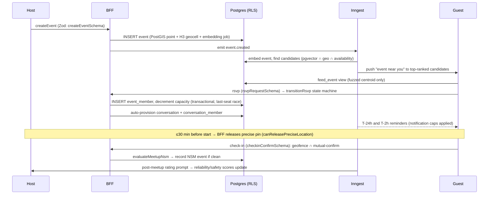

# Tayfa — System Architecture

> Verified, location-based social meeting app (explicitly **not** a dating app) for
> 18–32-year-olds new to a city. Beachhead: Istanbul. GDPR + KVKK, EU/Frankfurt
> data residency from day one.
>
> The canonical product source of truth is [`roadmaps/APP_EXECUTION_ROADMAP.md`](../roadmaps/APP_EXECUTION_ROADMAP.md);
> mandatory architecture decisions live in [`reports/TECH_DECISIONS.md`](../reports/TECH_DECISIONS.md)
> (condensed as ADRs in [`DECISIONS.md`](./DECISIONS.md)); mandatory safety
> constraints live in [`reports/RISK_ANALYSIS.md`](../reports/RISK_ANALYSIS.md).
> **When documents conflict, RISK_ANALYSIS wins.**

---

## 1. High-level topology (roadmap §4)



---

## 2. The two paths: client-direct-RLS vs. the BFF (ADR-005)

Tayfa deliberately runs **two** request paths, splitting the surface by sensitivity.
This is the single most important architectural choice in the system.

### 2.1 Client-direct to Postgres via RLS — the safe 80%

The mobile app talks **directly to Postgres** (through the Supabase client) for the
read/write operations that are naturally scoped to "my own rows" or to safe public
projections: read my profile, list events near me from the location-free `feed_event`
view, read a chat I belong to, write my RSVP. The Supabase anon key is *public-safe*:
Row-Level Security — **deny-by-default + FORCE on every table** — is the authorization
substrate. A user cannot read another user's private data **even with a stolen JWT**,
because the guarantee lives at the database, not at an API tier.

- **Why:** lowest latency (no server hop), thin server, fewer endpoints to maintain.
  From Turkey to Frankfurt every round-trip carries cross-border latency (ADR-014), so
  the client-direct reads are batched/cached (Redis geocell feed cache, §6).
- **Trust model:** the client is never trusted for authorization — RLS is. Invariants
  Zod cannot reach (because there is no server in the path) live as Postgres
  `CHECK`/constraints and triggers.

### 2.2 The thin BFF (Next.js Route Handlers on Vercel) — the sharp 20%

Anything **privileged, multi-party, or that requires a secret** routes through the BFF,
which runs as the **Supabase service role** (RLS bypass — `createServiceClient`). The
BFF is the *only* place the service-role key and provider secrets exist.

The BFF owns:

- **Matching / discovery ranking** — pgvector + PostGIS + reputation re-rank.
- **Payments / entitlements** — RevenueCat webhooks → authoritative `subscription` row.
- **Moderation orchestration** — report routing, provider calls, the T&S console.
- **Precise-location release** — the *only* code allowed to hand a non-fuzzed pin to a
  client, and only after `canReleasePreciseLocation` passes (§4).
- **Verification** — Persona inquiry creation + webhook resolution.
- **Identity-anchored writes** that need a secret or cross-user effects.

Every BFF boundary is **Zod-validated** (`packages/shared/src/schemas`). On provider
outage the BFF **fails closed** for verification and moderation (deny, never pass).

```
                 ┌──────────────────────────── client-direct (RLS-scoped) ───────────┐
   Mobile app ───┤  read profile · feed_event view · my chats · my RSVP              │──▶ Postgres
                 └────────────────────────────────────────────────────────────────────┘     ▲
                 ┌──────────────────────────── BFF (service role) ───────────────────┐       │
   Mobile/Web ──▶│  middleware (auth · geo · rate-limit · BotID) → Route Handlers     │───────┘
                 │  matching · payments · moderation · precise-location · verification │
                 └────────────────────────────────────────────────────────────────────┘
```

---

## 3. Data flow of the core loop (roadmap §4, Phase 3)



**Key invariants enforced in the loop (pure logic in `@tayfa/shared/domain`):**

- **RSVP** is a state machine: `requested → approved → going → attended | no_show | left`
  (`transitionRsvp`, `initialRsvpStatus`, `occupiesSeat`). Capacity decrement is
  transactional — the last-seat race is a tested concurrency case.
- **NSM** (`evaluateMeetupNsm`) counts a meetup only when ≥2 distinct attendees mutually
  confirm AND a geofence check passes near `starts_at`, with collusion share ≤ 5%
  (`NSM` constants: 250 m radius, ±30/180 min window). Designed to resist two-account gaming.
- **Reputation** (`computeReliabilityScore`, `computeSafetyScore`, `canHost`, `canDm`)
  gates hosting/DMs below the `REPUTATION_GATES` thresholds.
- **Notifications** (`canSendNotification`) honor per-category daily caps and a global
  ≤2/day ceiling (`NOTIFICATION_POLICY`, `GLOBAL_DAILY_NOTIFICATION_CAP`).

---

## 4. Location privacy (RISK_ANALYSIS §location — non-negotiable)

Precise coordinates **never leave the server** for a non-approved user. The structural
guarantee is built into the data layer, not bolted on at the API.

- `event.location` is `geography(Point,4326)` (PostGIS) — server-only.
- `event.geocell` is an **H3 index computed in app code** (`h3-js`, resolution 8,
  neighborhood granularity) and stored as text. No Postgres H3 extension dependency
  (ADR / `GEOCELL_RESOLUTION`).
- Discovery reads the **location-free `feed_event` view** (`sql/50_rls.sql`), which
  exposes the geocell + venue name but **not** the precise point. Clients see a
  **fuzzed geocell centroid** (`fuzz` in `domain/location-privacy.ts`).
- The precise pin is released **only by the BFF**, **only to approved members**, and
  **only within `PRECISE_LOCATION_RELEASE_WINDOW_MINUTES` (30 min)** before start — gated
  by `canReleasePreciseLocation`. A unit test proves precise coordinates never leak for
  non-approved users.
- `public_profile` view is the safe slice of other users — no birthdate/PII.

---

## 5. The data layer (`packages/db`)

A single Postgres database (ADR-003) — OLTP + PostGIS geo + pgvector ANN in one engine,
no separate search infra until a measured latency trigger.

### 5.1 Drizzle schema + authoritative hand-authored SQL

There are **two** representations of the schema, by design:

- **Drizzle schema** (`src/schema/*.ts`) — the **typed query layer** the app imports.
  Enums are generated from the *same* `const` tuples used by the TS unions and Zod
  schemas in `@tayfa/shared/types` (single source of truth — `schema/enums.ts`).
- **Authoritative SQL** (`sql/`) — the **deployment DDL** and source of truth for things
  the generator cannot express: PostGIS/pgvector **index types** (GiST, HNSW), RLS
  policies, and SQL functions/triggers. `drizzle-kit` is used for **drift detection**
  against this SQL, *not* as the migration source.

`runMigrations` (`src/migrate.ts`) applies the SQL files in lexical order — and the
order *is* the architecture:

```
00_extensions.sql  → postgis, vector, pgcrypto
05_auth_compat.sql → auth.users shim + auth.uid() (so RLS tests run off Supabase)
10_enums.sql       → Postgres enums (mirror the shared const tuples)
20_tables.sql      → 24 tables (Data Model §5): profile, event, event_member,
                     conversation, message, report, moderation_action, rating, …
30_indexes.sql     → GiST on event.location, HNSW on embeddings, composite feed idx
40_functions.sql   → set_updated_at trigger, is_event_member, is_conversation_member,
                     is_blocked, public_event_geojson (centroid-only)
50_rls.sql         → ENABLE + FORCE RLS on every table, per-op policies, the
                     feed_event + public_profile views
```

Every statement is idempotent (`IF NOT EXISTS` / `OR REPLACE` / guarded), so migration
is safe to re-run.

### 5.2 RLS: deny-by-default + FORCE (ADR-005)

- `ENABLE ROW LEVEL SECURITY` **and** `FORCE ROW LEVEL SECURITY` on every public table
  (FORCE so even the table owner obeys). **No policy ⇒ no access.**
- `auth.uid()` (from `request.jwt.claims.sub`) is the identity anchor; policies wrap it
  as `(select auth.uid())` and index policy columns for performance.
- Chat is readable **only by conversation members** (`is_conversation_member`); blocked
  users never see each other's content (`is_blocked` — total severance).
- **A table that ships without a tested policy fails CI** (`packages/db/src/rls.test.ts`).

### 5.3 Two client postures (`src/client.ts`)

- `createServiceClient` — service role, **bypasses RLS**. BFF / migrations / T&S console
  only. Never shipped to a client.
- `createRlsClient` — runs as the `authenticated` role with `request.jwt.claims` set, so
  deny-by-default RLS applies exactly as for that user. This is what the RLS tests exercise.

---

## 6. Async & workflows (Inngest) + caching (Upstash Redis)

**Inngest** (ADR-007) owns every multi-step, retryable, time-delayed flow — no cron-soup:

- `event.created` → embed + candidate match + "event near you" pushes + feed index.
- `event.reminder` (T-24h, T-2h) → reminders, frequency-capped.
- `event.checkin_window` → open the geofence/mutual-confirm window.
- `event.completed` → post-meetup rating + reputation update + crew prompt.
- Embeddings are recomputed **async, never in a request path**; verification, moderation
  escalation, lifecycle/retention journeys, and billing webhooks are all durable steps.
  Steps are **idempotent** (idempotency keys on writes and webhooks).

**Upstash Redis** (cache, rate-limits, idempotency). Caching keys (roadmap §4 caching):

| Purpose | Key shape | TTL |
|---|---|---|
| Hot discovery feed | `{geocell, interest_cluster, filters}` | short |
| Rate-limits | per `user` / `IP` / `action` (`RATE_LIMITS`) | sliding window |
| Session / verification claims | per user | session |
| Webhook idempotency | provider event id (RevenueCat / Persona / Inngest) | replay window |

Vercel Runtime Cache edge-caches the share/OG pages.

---

## 7. The provider-adapter pattern (`@tayfa/shared/adapters`)

Every external service sits behind a **TypeScript interface** with two implementations:
a deterministic **mock** and a production **adapter**. This is the mechanism that lets the
entire app run with **zero credentials** (mission §AUTONOMY) and keeps tests reproducible.

Interfaces (`adapters/types.ts`): `VerificationProvider`, `ModerationProvider`,
`BillingProvider`, `EmbeddingProvider`, `GenerativeProvider`, `PushProvider`,
`AnalyticsClient`, bundled as `Providers`.

- `createMockProviders()` returns a full `Providers` set. Mocks honor the **production
  contract** — same shapes, **fail-closed semantics** (e.g. `MockVerificationProvider`
  returns `null` for any malformed webhook payload), deterministic pseudo-embeddings via
  an FNV-1a-seeded PRNG — so swapping in a real adapter changes nothing for callers.
- **`TAYFA_PROVIDER_MODE=mock`** forces all providers into mock mode regardless of which
  keys are present (used by CI and local dev). In production, the BFF selects the real
  adapter when its key is present and falls back to the mock otherwise (mission AUTONOMY
  rule: "use a mock adapter when a provider key is absent").

> The `shared` and `db` packages are the **spine** and are fully built, typechecked, and
> tested. The mobile app, web/BFF, and the production adapters are the drop-in surfaces
> tracked in [`KNOWN_LIMITATIONS.md`](./KNOWN_LIMITATIONS.md).

---

## 8. Package boundaries

| Package | Role | I/O |
|---|---|---|
| `@tayfa/shared` | Contract: Zod schemas, analytics taxonomy, domain types, **pure** business logic, provider interfaces + mocks | **Zero I/O**, 99% domain coverage |
| `@tayfa/db` | Drizzle schema + authoritative SQL (PostGIS, pgvector, RLS), client factories, migrations, seed | Postgres only |
| `apps/mobile` | Expo / React Native primary surface | client-direct RLS + BFF |
| `apps/web` | Next.js: landing, OG share, KVKK pages, moderation console, **the BFF** | service role |

Dependency rule: `db` and the apps depend on `shared`; nothing depends on the apps. The
domain core has no knowledge of Postgres, HTTP, or any provider — it is a pure, testable
kernel the rest of the system orbits.
