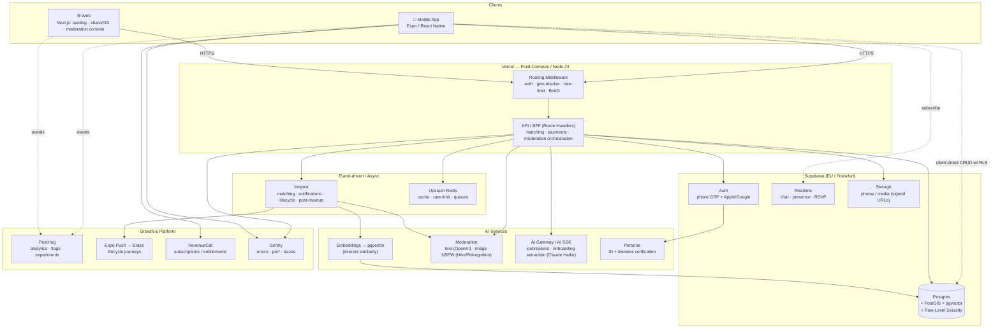

# APP EXECUTION ROADMAP — Tayfa (working codename)

> **Idea class:** City-based, hobby-driven social discovery for young people · small-group, real-life activities · fully verified profiles · explicitly *not* a dating app.
> **Working codename:** **Tayfa** (Turkish youth slang for "crew / squad"). Ties to the idea's stated goal of a "modern neighborhood culture." Final brand TBD.
> **Beachhead market:** Istanbul (dense, young, mobile-first, high loneliness-among-newcomers signal), then İzmir/Ankara → EU university cities.
> **Compliance baseline:** GDPR + KVKK (Turkey). Designed EU/TR-first.
> **Target platform:** Cross-platform mobile (primary) + thin web (landing, share pages, moderation console).
> **Generated:** 2026-06-26 · Roadmap version 1.0

This document is the canonical execution plan. Four companion deep-dives live in `/reports`: `RISK_ANALYSIS.md`, `GROWTH_STRATEGY.md`, `TECH_DECISIONS.md`, `MONETIZATION_ANALYSIS.md`. Where this roadmap summarizes, the reports go deep — but **this file is the source of truth** for stack, phases, North Star, and market.

---

## 1. Startup Overview

**One sentence:** Tayfa is a verified, location-based social app that turns shared hobbies into real-life small-group hangouts ("anyone want to ride bikes Sunday morning?") for young people who are new to a city or tired of being lonely in it.

| Dimension | Definition |
|---|---|
| **Target users** | 18–32, urban, recently relocated / students / early-career; "loose-tie poor" — have acquaintances but no activity crew. Primary persona: *Newcomer Nilay* (moved to Istanbul for work, 0 local friends). Secondary: *Rooted-but-bored Burak* (lived here for years, friend group dispersed, wants new activity partners). |
| **Core use cases** | (1) Spin up a micro-event around an activity ("padel tonight, need 2"). (2) Discover & join nearby events matching my interests. (3) Find 1–3 people with overlapping taste to actually *do the thing*. (4) Build a recurring crew (the bike Sunday people, the board-game Thursday people). |
| **Value proposition** | "Friends through *doing*, not swiping." Small groups kill first-meeting shyness; verification + group format kills the safety and "is this a date?" anxiety; interest-matching kills the empty-feed problem of generic friend apps. |
| **Positioning** | Anti-dating-app, anti-doomscroll. The product north is **memories made offline**, the app is just the matchmaker for *activities*. |
| **Market category** | Social discovery / IRL community / "interest-graph social." Adjacent to Meetup, Bumble BFF, Timeleft, Eventbrite — but none own *spontaneous, hobby-matched, small-group, verified, hyperlocal*. |
| **Monetization** | Freemium consumer subscription (**Tayfa+**) + later marketplace take (featured/ticketed events, venue partnerships). Safety is **never** paywalled. See §7 + `MONETIZATION_ANALYSIS.md`. |
| **North Star Metric (NSM)** | **Weekly Completed Meetups** — distinct events where ≥2 verified users were confirmed present (geofence + mutual confirmation). This is the unit of real value; everything upstream (signups, matches, RSVPs) is instrumental. |
| **MVP success metrics** | • ≥35% of activated users attend ≥1 meetup within 14 days. • ≥25% W4 retention (cohort still attending/creating). • ≥1.3 meetups per active user per month. • Median time-from-signup-to-first-meetup < 7 days. • <0.5% safety-incident rate per meetup, with 100% report→action SLA < 4h. |

**Why this can win:** the hard part of IRL social apps is *liquidity in a place + trust*. We attack both with a hyperlocal beachhead (one city, seeded supply of events) and verification + small-group format as the trust primitive. The interest graph is the moat that compounds.

---

## 2. Product–Market Analysis

**Pain points (ranked):**
1. **The empty-Saturday problem** — newcomers have time and willingness but no one to do things *with*. Existing tools surface *people* (profiles) not *plans*.
2. **First-meeting dread** — 1:1 meetings with a stranger feel like a date / interview. Small groups defuse this; it's the product's core insight.
3. **Safety anxiety** (esp. women) — meeting strangers from an app is scary. Unverified profiles + 1:1 default = non-starter for a huge segment.
4. **Empty-feed cold start** — generic "make friends" apps show you a wall of strangers with no reason to act. Without an *activity hook*, nothing happens.
5. **"Is this a date?" ambiguity** — dating-app crossover poisons platonic intent. Users want an explicitly non-romantic space.

**Alternatives & their weaknesses:**

| Alternative | What it does | Where it fails for this user |
|---|---|---|
| Meetup | Interest groups + events | Skews older/professional, large impersonal events, dated UX, weak mobile/realtime, no verification, no small-group intimacy |
| Bumble BFF | Friend-finding via swipe | 1:1 swipe paradigm = dating mechanics reskinned; "is this a date?" ambiguity; no activity/event layer; shyness intact |
| Timeleft / dinner apps | Algorithmic group dinners | Single modality (dinner), low spontaneity, no interest-matching depth, no recurring-crew formation |
| Eventbrite / Luma | Event listing/ticketing | Top-down events, not peer micro-plans; no matching; no "find 2 people for padel tonight" |
| Discord / WhatsApp groups | Chat communities | No discovery, no verification, no IRL coordination layer, no geolocation; you must already know the group |
| Strava / Nike Run Club | Activity + social | Single-vertical (sport), social is secondary, not designed to form *new* local friendships |

**Opportunities / differentiation:**
- **Spontaneous micro-events** ("tonight/this weekend") — a modality nobody owns well.
- **Interest graph beyond photos** — match on music taste, shows, teams, concerts wanted, sports wanted → instant conversation surface.
- **Small-group-by-default** (2–6) — the safety + anti-shyness wedge.
- **Verification as a feature, not a tax** — phone + ID + photo liveness becomes a trust badge users *want*.
- **Recurring crew formation** — turn one-off meetups into habitual groups = retention moat.

**Behavioral psychology levers:** social proof ("3 people you'd vibe with are going"), commitment & consistency (RSVP → reminder → show-up streak), the mere-exposure effect (recurring crews), loss aversion ("your Sunday bike crew is meeting without you"), and identity ("I'm a Tayfa person who *does* things").

**AI leverage:** (1) semantic interest-matching via embeddings; (2) feed/recommendation ranking; (3) safety — automated text/image moderation + risk scoring; (4) onboarding — extract interests from free text & connected accounts; (5) cold-start liquidity — AI-suggested event templates & icebreakers so an empty city still feels alive.

**Network-effect potential:** strong but *local*. Value is per-city density, not global. Implication: growth must be **city-by-city saturation**, not thin global spread. Each saturated city is a defensible, compounding graph; the interest data + reputation system raise switching costs.

---

## 3. Recommended Tech Stack

Priority order honored: **Simplicity → Maintainability → Scalability → Advanced features.** Every choice is "boring where it can be, sharp where it must be." Full reasoning, alternatives, and ADRs in `reports/TECH_DECISIONS.md`.

| Layer | Choice | Why | Tradeoff / when it breaks | Scale path |
|---|---|---|---|---|
| **Mobile (primary)** | **Expo (React Native) + TypeScript**, Expo Router, NativeWind, React Query + Zustand | One codebase iOS/Android; OTA updates (EAS Update) = ship daily without store review; huge hiring pool; native push/location/camera | Heavy native modules (advanced AR, deep BLE) need config plugins; perf ceiling below pure-native for graphics | EAS Build/Submit; eject specific modules to native only if profiling demands |
| **Web** | **Next.js (App Router) on Vercel** | Landing/SEO, OG share pages (viral loop), moderation console, internal admin | Not the primary surface; keep thin | ISR for share pages; Server Components for admin |
| **Backend / BaaS** | **Supabase** (Postgres, Auth, Realtime, Storage, Edge Functions, RLS) | Collapses auth+DB+realtime+storage+row-security into one managed stack → maximum MVP velocity, minimum ops | Vendor coupling; complex business logic outgrows Edge Functions | Extract hot paths to dedicated Node services; Supabase stays system-of-record |
| **API / BFF** | **Next.js Route Handlers + Vercel Functions** (Fluid Compute, Node 24) for orchestration; Supabase RLS for direct CRUD | Thin BFF for cross-service orchestration (matching, payments, moderation); RLS handles the 80% CRUD safely from client | Must be disciplined about what is client-direct vs BFF | Promote BFF to standalone service (NestJS/Hono) at scale |
| **Database** | **PostgreSQL** + **PostGIS** (geo) + **pgvector** (interest embeddings) | One DB for relational + geospatial discovery + semantic matching → no premature vector-DB/Elastic sprawl | Single-DB contention at very high scale | Read replicas → city-sharding/partitioning → dedicated vector store (e.g. Qdrant) only if pgvector latency degrades |
| **ORM** | **Drizzle ORM** | TS-native, SQL-first (critical for PostGIS/pgvector raw power), tiny runtime, great migrations | Less "magic" than Prisma; smaller ecosystem | Stays; raw SQL escape hatch always available |
| **Auth & identity** | **Supabase Auth** — phone OTP (primary), Apple/Google social; **Persona** (or Stripe Identity) for ID + liveness | Phone-first fits young users & verification story; ID/liveness powers the trust badge | ID verification adds cost (~$1–1.5/verify) & friction | Tiered verification (phone free, ID for "Verified+" badge / hosting) |
| **Realtime / chat** | **Supabase Realtime** (MVP group chat, presence, RSVP live) → **Stream Chat** at scale | Free/cheap, in-stack for MVP small-group chats | Realtime not purpose-built for rich chat (reactions, moderation, threads, media) at volume | Migrate chat to Stream (managed moderation, scale) once chat is core retention surface |
| **Async / workflows** | **Inngest** (durable event-driven: matching, notifications, lifecycle, post-meetup flows) + **Upstash Redis** (cache, rate-limit, ephemeral queues) | Durable, retryable, observable workflows without standing infra; serverless-native | Another vendor; cold-start nuance | Self-host workers / move to Temporal only if workflow volume demands |
| **Storage / media** | **Supabase Storage** (MVP) → **Cloudflare R2 + CDN** (scale) | Profile/event photos with RLS; cheap egress on R2 later | Image transforms need a pipeline | Add imgproxy/Cloudflare Images; signed URLs throughout |
| **Push / messaging** | **Expo Push** (MVP) → **Braze** or **Customer.io** (lifecycle/retention campaigns) | Expo push is free & instant; behavioral messaging needs a real CRM later | Expo push lacks segmentation/journeys | Braze for journeys, A/B push, throttling (anti-spam, see §6) |
| **Payments** | **RevenueCat** over App Store / Google Play IAP; **Stripe** for web/venue payouts | RevenueCat = cross-platform subs, entitlements, receipts, analytics; mandatory IAP for mobile digital goods | RevenueCat fee (~1% over free tier); store 15–30% cut | Negotiate store small-business rate (15%); push web checkout where allowed |
| **CI/CD** | **GitHub Actions** + **Vercel** (web) + **EAS Build/Submit/Update** (mobile) | Standard, fast, OTA hot-fixes via EAS Update | Mobile store review still gates native changes | Add release trains, staged rollouts, EAS channels per env |
| **Observability** | **Sentry** (RN + web errors + perf) · structured logs · **Better Stack/Checkll** uptime · OpenTelemetry traces on BFF | Catch crashes & regressions early on both surfaces | Cost grows with volume; sample | OTel → Grafana/Tempo; SLO dashboards |
| **Analytics + experimentation + flags** | **PostHog** (product analytics, funnels, session replay, feature flags, A/B experiments) | One tool for the entire growth loop; self-host option = KVKK/GDPR data-residency control (EU region) | Heavy; needs event-schema discipline | Pipe to **BigQuery** + **dbt** for deep analysis; PostHog stays the activation layer |
| **AI tooling** | **Vercel AI Gateway + AI SDK v6** (generative: icebreakers, onboarding extraction — default **Anthropic Claude** models, Haiku-tier for cheap/fast); **OpenAI/Cohere or local embeddings** → pgvector (matching); **Hive / AWS Rekognition** (image NSFW + face checks); **OpenAI Moderation** (text) | Gateway = provider failover + cost observability + zero-retention; right tool per job (generate vs embed vs moderate) | Multiple AI vendors to manage; moderation false-positives need human-in-loop | Cache aggressively; route by cost; bring embeddings in-house if volume justifies |
| **Infra / region** | Vercel (functions) + Supabase **EU region** (Frankfurt) | Data residency for GDPR/KVKK; low latency to TR/EU | TR has no Vercel/Supabase region — Frankfurt is closest compliant | Add Istanbul edge caching (Cloudflare) for static/media |

**Explicitly rejected for MVP (anti-overengineering):** Kubernetes, microservices, Kafka, a separate vector DB, custom auth, GraphQL gateway, multi-cloud, self-hosted everything. We earn complexity only when a metric forces it (documented as triggers in `TECH_DECISIONS.md`).

---

## 4. System Architecture



**Frontend topology.** Mobile is the product. It talks **client-direct to Postgres via RLS** for the safe 80% (read events near me, my profile, my chats) and routes the sharp 20% (matching, payments, moderation, anything privileged) through the **BFF**. This keeps latency low and the server thin while RLS guarantees a user can never read another user's private data even with a leaked token.

**Auth flow.** Phone OTP → Supabase session (JWT). Sensitive actions (hosting, DMs, certain venues) require **step-up verification**: ID + liveness via Persona, stored as a `verification` record; the JWT/claims carry `verification_level`. Middleware enforces level per route. Social login optional for convenience, never as the *only* trust signal.

**Data flow — the core loop.** Create event → write to Postgres (PostGIS point) → Inngest `event.created` fans out: (a) embed event for matching, (b) find candidate users via pgvector + geo + availability, (c) push "event near you" to top-ranked candidates, (d) index for the discovery feed. RSVP → `rsvp.created` → host notified, capacity decremented, chat thread provisioned. T-2h → reminder. Post-event → geofence/mutual-confirm → **NSM event recorded** → rating + rebooking prompts.

**Events / async.** Inngest owns every multi-step, retryable, time-delayed flow: matching, notification orchestration (with frequency caps), verification pipelines, moderation escalation, post-meetup ratings, lifecycle/retention journeys, billing webhooks. No cron-soup; durable & observable.

**Caching.** Upstash Redis for: hot discovery feeds (per geocell + interest cluster, short TTL), rate-limits (per-user/IP/action), session/verification claims, idempotency keys for webhooks. Vercel Runtime Cache for edge-cached share/OG pages.

**Analytics pipeline.** Client + server emit a **typed event schema** (see §6/Growth report) → PostHog (real-time funnels, flags, experiments, replay) → nightly export to BigQuery + dbt models (cohorts, LTV, meetup-success attribution) → reverse-ETL audiences back to Braze for targeted journeys.

---

## 5. Data Model Design

**Core entities & key relationships** (Postgres; UUID PKs; `created_at/updated_at` everywhere; soft-delete via `deleted_at` on user-content):

- **user** (auth, Supabase-managed) 1—1 **profile** (display_name, birthdate→age, bio, home_city_id, neighborhood, avatar, languages, `verification_level` enum{none,phone,id,id_live}, `safety_score`, `reliability_score`).
- **interest_taxonomy** (canonical tags: domain{music_genre, artist, tv_show, sport, hobby, cuisine, cause...}, label, slug, `embedding vector(1536)`) —< **user_interest** (user_id, interest_id, weight, source{onboarding, connected_account, inferred}) and —< **event_interest**.
- **profile** holds `interest_embedding vector(1536)` (aggregate of weighted interests) for fast ANN matching.
- **event** (host_id, title, description, category, `location geography(Point,4326)`, venue_name, `starts_at`, `ends_at`, capacity{min,max}, visibility{public, interest_match, invite}, `status` enum{draft,open,full,confirmed,completed,cancelled}, `embedding vector(1536)`, gender_balance_policy, age_range).
- **event_member** (event_id, user_id, role{host,member}, `rsvp_status` enum{requested,approved,going,attended,no_show,left}, joined_at) — the RSVP + attendance ledger.
- **crew** (recurring group formed from repeat co-attendance) —< **crew_member**; optional **crew_event** link → powers retention loop.
- **conversation** (scope{event, crew, dm}, scope_id) —< **message** (sender_id, body, media_url, `moderation_status`) ; **conversation_member** for read-state/mute.
- **verification** (user_id, type{phone,id,liveness}, provider, provider_ref, status, verified_at).
- **report** (reporter_id, target_type{user,event,message}, target_id, reason, evidence_url, status) → **moderation_action** (actor{ai,human}, action{warn,remove,suspend,ban,clear}, rationale). **block** (blocker_id, blocked_id).
- **rating** (rater_id, target_user_id, event_id, vibe{1–5}, showed_up bool, would_meet_again bool, flags) → feeds `reliability_score` & `safety_score`.
- **notification** (user_id, type, payload, channel, sent_at, opened_at) ; **device** (user_id, expo_push_token, platform, last_seen).
- **subscription** (user_id, product, store, `entitlement`, status, renews_at) — mirrored from RevenueCat. **referral** (referrer_id, referee_id, code, status, reward_state).
- **city** / **geocell** (H3 index) for liquidity ops & feed bucketing.

**Indexing & performance:**
- `GiST` on `event.location` (PostGIS) for "within Xkm" discovery.
- `ivfflat`/`hnsw` on `profile.interest_embedding` and `event.embedding` for ANN interest matching.
- Composite `(home_city_id, starts_at, status)` on event for feed; partial index `WHERE status='open'`.
- `(user_id, rsvp_status)` on event_member; `(conversation_id, created_at desc)` on message.
- H3 geocell column on event/profile for cheap bucketed feeds & liquidity heatmaps.

**Security & multi-tenant posture:** Not multi-tenant (B2C), but treat **every row as user-owned**. **RLS on by default, deny-by-default**: a user reads only public events, events they're a member of, their crews/DMs, their own profile + the *public* slice of others. Private fields (exact location until approved, contact, birthdate) exposed only via policy/views. Exact event location is **fuzzed** (geocell centroid) for non-approved members; precise pin released only to approved attendees near start time. Messages readable only by `conversation_member`. Moderation/admin access via service-role through BFF, never client.

**Scaling concerns:** chat (`message`) is the write-hot table → partition by month / migrate to Stream at scale. Feed reads → Redis cache + geocell bucketing. Embeddings recompute async on interest change (Inngest), never in request path. City-sharding is the long-horizon lever (each city is a near-independent graph).

---

## 6. Growth & Retention Strategy

Full playbook in `reports/GROWTH_STRATEGY.md`; the canonical model:

**Activation (the only thing that matters early):** Activation = **first completed meetup**, not signup. Onboarding is engineered to drive toward it:
- *Onboarding psychology:* progressive disclosure, < 90s to a populated feed. Pick interests as **tappable taste cards** (artists/shows/sports — concrete, identity-affirming, fun) not a form. Show **liquidity proof immediately** ("12 events near you this week") — seeded if necessary (see cold-start).
- *Friction stripping:* phone OTP only to start; defer ID verification until the user wants to host/DM (value-first, then trust-step-up). Pre-fill interests from optional Spotify/Apple Music/Letterboxd connect.
- *First-action nudge:* the moment interests are set, surface **one perfect low-stakes event** ("Sunday coffee crawl, 4 going, 2 share your love of indie") with a one-tap RSVP.

**Retention loops (D1/D7/D30):**
- **D1:** RSVP confirmation + "your meetup is in 3 days" + chat thread comes alive (host + members). Notification: someone joined / said hi.
- **D7:** *Post-meetup loop* — rate vibe, "meet again?", and **crew formation** prompt ("You + 2 others clicked — make it a weekly thing?"). The recurring-crew is the single strongest D7→D30 lever.
- **D30:** **Habit ritual** — "Your Sunday bike crew rides this week" recurring events, weekly "what's your city doing this weekend" digest, streaks for consecutive weeks with ≥1 meetup. Identity reinforcement ("you've made 6 real plans, top 10% in Kadıköy").

**Habit & gamification (tasteful, anti-vanity):** show-up **reliability score** (social currency: reliable people get invited more — aligns incentive with real value), weekly meetup streak, "first to 3 crews" style milestones, neighborhood leaderboards for *hosts* (supply-side gamification). **No** dark patterns, no engagement-bait that keeps people *in-app* — the app wins when users are *out* with people.

**Referral & virality:**
- **Structural virality:** every event is inherently multiplayer — inviting friends to *your* event is the natural act. Group invite links open OG share pages (web) → app install.
- **Incentivized referral:** "bring a friend who's also new here" → both get Tayfa+ trial; reward unlocks on *referee's first meetup* (quality-gated, not signup-gated → anti-fraud).
- **Shareability:** beautiful post-meetup recap cards ("Kadıköy bike crew · 5 riders · 18km") shareable to IG stories — social proof + acquisition.
- **Social proof everywhere:** "people you'd vibe with are going," mutual interests on cards, verified badges.

**Cold-start liquidity (the make-or-break):** one city at a time. Seed supply with **ambassador hosts** (paid/perks), AI-generated **event templates** so creating feels effortless, and a "ghost-town guard" — never show an empty feed; always have curated/partner events. Demand seeded via campus + niche-community (running clubs, climbing gyms, board-game cafés) partnerships. Liquidity target before scaling a city: **≥40 live events/week within 5km of median user.**

**Notifications (retention engine, not spam):** behavioral triggers via Inngest/Braze with **hard frequency caps** and ML send-time optimization. Categories: your-plans (high priority), social (someone joined/messaged), discovery (perfect-match event), lifecycle (win-back). Every push must pass the "would a friend text this?" bar.

**Targets:** D1 ≥45%, D7 ≥30%, D30 ≥22% (active = created/attended/joined); viral coefficient k ≥ 0.4 within a saturated city; ≥1.3 meetups/active/month rising to 2.5+.

---

## 7. Monetization Strategy

Full model, unit economics, and pricing tests in `reports/MONETIZATION_ANALYSIS.md`. Canonical decisions:

- **Model:** Freemium consumer subscription (**Tayfa+**), monthly/annual, via RevenueCat/IAP. Marketplace revenue (featured & ticketed events, venue partnerships) layered in at Scale.
- **Free tier (generous on purpose — liquidity > revenue early):** discover & join unlimited public events, create events, group chat, baseline verification, all **safety features free forever**.
- **Tayfa+ (~₺149/mo or €6.99/mo; annual ~40% off):** advanced interest filters, "see who's interested before you commit," profile boost in match ranking, travel mode (plan before you move cities), unlimited active crews, read receipts, extra photos/prompts, early access to popular events, premium recap cards.
- **Free→paid path:** value-first. Paywall appears at *aspiration moments* (you've had 2 great meetups → "boost into the events that fill up fast"), never blocking core/social/safety. Trigger Tayfa+ trial at the post-meetup high.
- **Pricing psychology:** annual anchored against monthly; trial gated to engaged users (higher convert, lower churn); local price points (TR vs EU PPP). Frame as "more & better plans," not "unlock basic features."
- **Conversion target:** 3–5% free→paid in saturated cities; premium ARPU drives blended ARPU while marketplace adds non-sub revenue without taxing the social graph.
- **Churn risks & answers:** seasonal (winter dip) → indoor-activity programming + win-back; "found my crew, don't need premium" → premium value must be discovery/expansion, and crews create their *own* retention even off-premium (fine — they feed NSM & virality).
- **Premium opportunities later:** host pro-tools (recurring ticketed events, RSVP management), brand/venue sponsored events (clearly labeled), Tayfa for campuses/relocation-services (B2B2C).
- **Never:** paywall safety, verification-to-be-safe, reporting, or blocking. Trust is the moat — selling it would burn it.

---

## 8. AI & Infrastructure Cost Analysis

**AI cost drivers (per-user, order-of-magnitude; refined in reports):**

| Function | Tech | Cost shape | Est. per active user/mo | Notes |
|---|---|---|---|---|
| Interest/event embeddings | text-embedding (small) → pgvector | per-token, tiny | < €0.01 | Recompute only on interest/event change; cache |
| Match ranking | pgvector ANN (in-DB) | DB compute | ~€0.00 marginal | No external call; the moat is cheap |
| Text moderation (chat) | OpenAI Moderation (free/cheap) | per-message | ~€0.01–0.03 | Only moderate new/edited msgs; hash-cache |
| Image moderation (photos) | Hive / Rekognition | ~€1–2 / 1k images | ~€0.02 | Profile + event photos at upload; not per-view |
| ID + liveness | Persona / Stripe Identity | **€1–1.5 / verification** | one-time | **Biggest line.** Gate to hosts/DM/Verified+; not all users |
| Generative (icebreakers, onboarding extraction) | AI Gateway → **Claude Haiku** | per-token | < €0.02 | Cache by interest-cluster; cap calls; templated fallback |

**Infra cost shape:** Supabase (DB/auth/realtime/storage) scales by tier — biggest jumps at realtime-chat volume and storage egress. Vercel Functions priced on **Active CPU** (thin BFF keeps this low). Push is ~free until Braze. PostHog scales by event volume — **event-schema discipline** (don't log noise) is a direct cost control.

**Scaling / burn risks:**
1. **ID verification at signup** would be a cash incinerator — mitigated by *deferred, tiered* verification (only hosts/DM/Verified+ pay the cost; phone is free).
2. **Chat at scale** on Supabase Realtime → migrate to Stream before it becomes the cost & reliability bottleneck (trigger: chat = top retention surface + >X concurrent).
3. **Image storage egress** → Cloudflare R2 + CDN + on-the-fly transforms; never serve originals.
4. **Notification spend (Braze)** scales with MAU — but frequency caps (needed for UX anyway) cap cost.
5. **PostHog event volume** → sample high-frequency events, model deep analysis in BigQuery.

**Optimization levers:** aggressive caching (Redis feeds, embedding cache, moderation hash-cache), async-everything (no AI in request path), deferred/tiered verification, in-DB matching (pgvector) instead of external vector service, send-time-optimized + capped notifications. **Rule:** every AI call is cached, batched, or deferred — never synchronous in a hot path.

---

## 9. Security & Compliance Analysis

This is a **meet-strangers-IRL** app — security & safety are existential, not a checkbox. Full register in `reports/RISK_ANALYSIS.md`.

- **Auth:** phone OTP with rate-limit + abuse detection; short-lived JWTs + refresh; step-up (ID/liveness) for privileged actions; device binding for push; Vercel BotID + WAF rate-limits on auth endpoints.
- **API abuse:** per-user/IP/action rate limits (Redis), idempotency on writes & webhooks, deny-by-default RLS, signed URLs for media, schema validation (Zod) on every boundary, BFF for anything privileged.
- **Data privacy (GDPR + KVKK):** EU-region data residency (Frankfurt); **explicit, granular consent** (separate consents for location, connected accounts, marketing); **data-subject rights** built in (export, delete/erasure, rectification) from MVP, not bolted on; minimal-data principle (don't collect what we don't use); KVKK *aydınlatma metni* (disclosure) + VERBİS registration; DPA with every sub-processor; age-gate 18+.
- **Location privacy (critical):** never expose precise user location; event locations fuzzed to geocell until RSVP approved; precise pin only near start, only to approved members; no public "who's nearby" map of people. "Share my live location with my crew" is opt-in, time-boxed.
- **Payment security:** PCI handled by RevenueCat/Stripe (no card data touches us); server-side receipt validation; entitlement source-of-truth server-side.
- **Prompt injection / AI misuse:** treat all user content as untrusted in AI flows; output-encode; the moderation LLM/embeddings never execute user instructions; jailbreak/abuse detection on generative features; rate-limit AI endpoints; human-in-loop for moderation actions above a confidence threshold.
- **Trust & Safety (product-level):** mandatory block/report from day one; small-group-default reduces 1:1 risk; verified-profile badges; post-meetup safety ratings feed risk scoring; **safety center** (share plans with a friend, in-app emergency/check-in, local helpline numbers); proactive moderation (image NSFW + text) + reactive (report→action SLA <4h, <30min for safety-critical); ban-evasion detection (device/phone/ID fingerprinting); women-safety features (women-only events option, verified-only filters).
- **Multi-tenant/data isolation:** RLS deny-by-default; admin/moderation strictly via BFF service-role + audit log; least-privilege keys; secrets in Vercel/Supabase vaults, never client.

---

## 10. Phase Plan

Grouped **MVP → Growth → Scale**, mapping IDEA→MVP→PMF→SCALE. Each phase is **independently deployable**, has **no duplicated systems**, and uses the §7 mandatory template. Effort assumes a lean team (2 mobile, 1 full-stack/infra, 1 designer, 0.5 T&S/ops, founder on growth) + AI coding agents.

### — MVP PHASES (prove the core loop in one city) —

---

📍 **Phase 1: Foundation — Identity, Verified Onboarding & Platform Skeleton**
**Objective:** A new user can sign up (phone OTP), complete a verified, interest-rich profile, and land on a non-empty home screen — on a production-grade, observable, compliant platform skeleton.
**Business Goal:** Establish the trust primitive (verification) and the data foundation (interest graph) that every later phase compounds on. De-risk compliance before any user data exists.
**Dependencies:** None (foundational).
**Deliverables:** Expo app shell + Next.js web/landing; Supabase project (EU) w/ Postgres+PostGIS+pgvector, RLS deny-by-default; phone-OTP auth; onboarding flow (taste-card interest picker, optional music/film connect); profile model + interest taxonomy seeded; CI/CD (GitHub Actions + EAS + Vercel); Sentry + PostHog wired; GDPR/KVKK consent + privacy/DPA scaffolding; data export/delete endpoints.
**Tech Decisions:** Supabase (collapse auth+DB+storage+RLS → velocity); Expo (cross-platform + OTA); Drizzle (SQL-first for PostGIS/pgvector); PostHog from event #1 (instrument before you have users); pgvector now (cheap to add, expensive to retrofit). *Reasoning:* get the irreversible decisions (data residency, RLS posture, event schema, verification model) right while the cost of change is ~zero.
**Growth Assumptions:** Onboarding completion ≥70%; <90s signup→populated feed; interest-picker is *fun* (identity-affirming) → higher completion.
**Monetization Assumptions:** None yet (don't monetize before value). Entitlement model stubbed so paywalls drop in later without refactor.
**Tasks:**
  - **Frontend:** Expo Router scaffold, design system (NativeWind tokens), auth screens (phone OTP), onboarding wizard (taste cards w/ search, optional OAuth connects), profile view/edit, home shell with feed placeholder + liquidity-proof banner. Web: landing + privacy/terms + OG share scaffold.
  - **Backend:** Supabase schema (user/profile/interest_taxonomy/user_interest/device), RLS policies (deny-by-default + tested), taxonomy seed (genres/artists/shows/sports/hobbies + embeddings), Drizzle migrations, Zod-validated BFF for profile writes, data export/delete jobs (Inngest).
  - **Infrastructure:** GitHub Actions (lint/typecheck/test/build), EAS pipelines (dev/preview/prod channels), Vercel project, Supabase EU, secrets management, env separation, Sentry (RN+web), uptime checks.
  - **Analytics:** typed event schema v1 (signup_started/completed, interest_added, onboarding_completed), PostHog identify + funnels, consent-gated tracking.
  - **Testing:** unit (domain logic), RLS policy tests (every table, deny-by-default proven), E2E onboarding (Detox/Maestro), accessibility pass.
  - **Growth Systems:** liquidity-proof banner (even if seeded), connect-accounts interest enrichment, onboarding funnel instrumentation.
**Critical Considerations:** RLS *must* be deny-by-default and policy-tested before launch (security). Data residency + consent correct *before* first user (legal/KVKK). Event schema designed once, properly (changing it later is painful). Onboarding friction is the activation ceiling. Age-gate 18+.
**Success Metrics:** onboarding completion ≥70%; signup→feed <90s p75; 0 RLS leaks in test matrix; crash-free sessions ≥99.5%; consent capture 100%.
**Risk Analysis:** *Technical* — RLS misconfig leaks data (mitigate: exhaustive policy tests). *Product* — interest picker too tedious (mitigate: taste cards + connect imports). *Growth* — empty feed kills first impression (mitigate: liquidity-proof + Phase 3 seeding). *Scaling* — schema churn (mitigate: model review now).
**Execution Prompt (FOR AI AGENT):**
> Build the foundation for "Tayfa," a cross-platform social app, as a monorepo (`pnpm` workspaces): `apps/mobile` (Expo + Expo Router + TypeScript + NativeWind + React Query + Zustand), `apps/web` (Next.js App Router on Vercel), `packages/db` (Drizzle schema + migrations), `packages/shared` (Zod schemas, typed event taxonomy, domain types). **Backend:** Supabase project in EU (Frankfurt). Implement tables exactly per the Data Model §5 subset {user, profile, interest_taxonomy, user_interest, device, verification(stub)}. Add PostGIS + pgvector extensions; `profile.interest_embedding vector(1536)`. **RLS is deny-by-default**: write explicit policies and a test suite proving no cross-user reads; CI fails if any table lacks a tested policy. **Auth:** Supabase phone OTP; 18+ age-gate; short-lived JWT. **Onboarding:** taste-card interest picker (searchable, multi-domain) + optional Spotify/Apple Music/Letterboxd OAuth import that maps to taxonomy; compute aggregate interest embedding async via an Inngest function (never in request path). **Compliance:** granular consent capture (location/marketing/connected-accounts as separate toggles), `/account/export` and `/account/delete` (GDPR/KVKK erasure) endpoints, privacy policy + KVKK disclosure pages on web. **Instrumentation:** PostHog from the first screen with the typed event schema in `packages/shared`; consent-gated. **Quality bar:** strict TypeScript (no `any`), Zod validation on every server boundary, all secrets via env (never committed), Sentry on both apps. **Testing:** Vitest unit + Drizzle RLS policy tests + Maestro E2E for the full onboarding funnel; CI (GitHub Actions) must run lint, typecheck, test, and build for both apps and block merge on failure. **Anti-hallucination:** do not invent Supabase/Expo APIs — if unsure of a signature, check the installed package's types; never stub a security control as "TODO" and call it done. **Deliverable definition of done:** a user can install the dev build, sign up via OTP, complete onboarding with ≥5 interests, see their profile persisted with an embedding, and trigger an account export — with green CI and zero RLS leaks in the test matrix. **Validation:** output a checklist mapping each acceptance criterion to the test that proves it.

---

📍 **Phase 2: Interest Graph & Discovery Feed**
**Objective:** Turn the interest data into a living, ranked, geo-aware discovery feed — the user sees *relevant* events/people near them, not a wall of strangers.
**Business Goal:** Solve the empty-feed problem; make "relevance" the felt difference vs Meetup/BFF. This is the matching moat's first surface.
**Dependencies:** Phase 1 (profiles, interests, embeddings, geo).
**Deliverables:** geo+interest discovery feed (PostGIS radius × pgvector similarity × time), feed ranking service, "why you're seeing this" (mutual interests), search/filter (category, time, distance), Redis-cached feeds per geocell, basic people-discovery ("people you'd vibe with") gated behind privacy rules.
**Tech Decisions:** pgvector ANN + PostGIS in one query (no external search infra — anti-overengineering); Redis cache keyed by geocell+interest-cluster (sub-100ms feeds); ranking as a pure, testable function (explainable, tunable). *Reasoning:* relevance must be fast and cheap; keep it in-DB until a metric forces a search service.
**Growth Assumptions:** Relevant feed → higher RSVP intent; "mutual interests" surfacing raises tap-through; people-discovery seeds curiosity but events remain the primary CTA.
**Monetization Assumptions:** Establishes the surface where "advanced filters / boost" will later be premium — instrument filter usage now to size willingness-to-pay.
**Tasks:**
  - **Frontend:** feed UI (event cards w/ mutual-interest chips, distance, time, who's going), filters/search, empty-state → "create one" CTA, people-you'd-vibe-with row (privacy-safe).
  - **Backend:** ranking query (geo radius ∩ vector similarity ∩ availability ∩ freshness), feed pagination, Redis cache + invalidation on new events, fuzzed-location exposure, candidate-people endpoint respecting RLS/blocks.
  - **Infrastructure:** Redis (Upstash), feed cache warming via Inngest on event create, query performance budgets + slow-query alerts.
  - **Analytics:** feed_impression, card_tap, filter_used, ranking-position logging (for offline ranking eval).
  - **Testing:** ranking unit tests (golden cases), geo/vector query correctness, cache-invalidation tests, load test feed endpoint.
  - **Growth Systems:** "why you're seeing this" explainers, mutual-interest social proof, instrument filter demand.
**Critical Considerations:** location fuzzing must hold (privacy); ranking explainability (trust + debuggability); feed latency budget <150ms p75 (UX); cold geocells must never render empty (fallback to wider radius / curated).
**Success Metrics:** feed→event-detail tap-through ≥25%; p75 feed latency <150ms; ≥60% of feed taps are on interest-matched (not just nearest) events (proves matching adds value).
**Risk Analysis:** *Technical* — vector+geo query slow at scale (mitigate: indexes, cache, geocell bucketing). *Product* — relevance feels off early (mitigate: ranking eval harness, tune weights). *Growth* — sparse cities → thin feed (mitigate: Phase 3 supply seeding + radius fallback).
**Execution Prompt (FOR AI AGENT):**
> Implement the discovery feed for Tayfa. Add an `event` table per Data Model §5 (with `location geography(Point,4326)`, `embedding vector(1536)`, status, capacity, visibility) and seed a few hundred synthetic events across Istanbul geocells for testing. Build a **single ranking query** that combines: PostGIS `ST_DWithin` (distance), pgvector cosine similarity (interest match), recency, and capacity-remaining, returning a paginated, explainable feed. Expose mutual interests per card. **Privacy:** non-members see only fuzzed (geocell-centroid) locations — write a test that proves precise coordinates never leave the server for non-approved users. **Performance:** cache feeds in Upstash Redis keyed by `{geocell, interest_cluster, filters}` with short TTL + invalidation on event create/update (via Inngest); enforce a p75 <150ms budget with a load test. Build a **ranking evaluation harness** (golden input→expected-order fixtures) so weights are tunable without regressions. People-discovery endpoint must respect RLS + blocks and never expose private fields. **Quality bar:** explainable ranking (log feature contributions), strict types, Zod on boundaries, no N+1 queries. **Testing:** ranking golden tests, geo/vector correctness, cache invalidation, load test. **Anti-hallucination:** verify PostGIS/pgvector operator syntax against the actual extension version; do not approximate distance math. **Done when:** a test user in Kadıköy sees a ranked feed where interest-matched events outrank merely-nearby ones, with <150ms p75 and zero precise-location leakage. **Validation:** include the ranking-eval report and the latency/load-test output.

---

📍 **Phase 3: Core Loop — Events, Groups, RSVP, Chat & Baseline Safety**
**Objective:** Close the loop: a user can **create** a micro-event, others **discover & RSVP**, the group gets a **chat**, they **coordinate**, and the app **records a completed meetup (NSM)** — with block/report safety from day one.
**Business Goal:** This *is* the product. Proving this loop in one neighborhood is MVP success and the gate to all growth spend.
**Dependencies:** Phase 1 (identity), Phase 2 (discovery).
**Deliverables:** event creation (templates + custom), RSVP/approval flow + capacity, auto-provisioned group chat (Supabase Realtime) w/ presence, T-minus reminders (Inngest), check-in / mutual-confirm → **NSM event**, post-meetup rating (vibe/showed-up/again), **block + report** + basic moderation queue, host controls (approve/remove/cancel).
**Tech Decisions:** Supabase Realtime for MVP chat (in-stack, cheap, fine for ≤6-person groups); Inngest for the full event lifecycle (reminders, check-in window, post-meetup flow) — durable & retryable; geofence + mutual-confirm for NSM (anti-gaming). *Reasoning:* don't build chat infra or a job system from scratch; use durable primitives so the time-based loop is reliable.
**Growth Assumptions:** Group chat pre-meetup reduces no-shows & shyness (core thesis); reminders lift attendance; post-meetup "meet again?" plants the retention/crew seed.
**Monetization Assumptions:** still free; instrument "events that fill fast" (scarcity) to validate future "boost/priority access" premium.
**Tasks:**
  - **Frontend:** event create wizard (template gallery + map picker + capacity/visibility), event detail (who's going, mutual interests, join/request), RSVP states, group chat (messages, presence, system events), check-in screen, post-meetup rating, block/report flows, host management.
  - **Backend:** event/event_member/conversation/message/rating/report/block tables + RLS; RSVP state machine; capacity & approval logic; conversation auto-provision on join; Inngest lifecycle (`event.created`→match-notify, `event.reminder`, `event.checkin_window`, `event.completed`→rating); NSM recording (geofence ∩ mutual-confirm); report→moderation queue; precise-location release rule.
  - **Infrastructure:** Realtime channels + auth, push via Expo for chat/RSVP/reminders, moderation queue (web console v0), rate-limits on create/message.
  - **Analytics:** event_created, rsvp_made, chat_first_message, reminder_sent/opened, **meetup_completed (NSM)**, rating_submitted, report_filed.
  - **Testing:** RSVP state-machine tests, capacity race conditions, RLS for chat (only members), NSM anti-gaming tests, report→action E2E, reminder timing.
  - **Growth Systems:** post-meetup "meet again / make it weekly" prompt (crew seed), shareable recap card v0, no-show feedback loop.
**Critical Considerations:** **safety is non-negotiable** — block/report must ship in MVP, with report→action SLA and a real human in the loop. NSM must resist gaming (two accounts faking meetups) → geofence + mutual-confirm + reliability scoring. Capacity races (last seat) need transactional integrity. Precise location release timing (privacy). Chat moderation hooks even if light.
**Success Metrics:** ≥35% of activated users complete a meetup within 14 days; ≥70% of RSVPs with active chat actually attend; no-show <25%; report→action <4h (100%); ≥40% of completers tap "meet again."
**Risk Analysis:** *Technical* — realtime reliability / capacity races (mitigate: transactions, retries, Inngest). *Product* — no-shows erode trust (mitigate: reminders, reliability score, chat warm-up). *Safety* — bad actor at a real meetup (mitigate: verification, report SLA, ratings, ban-evasion). *Growth* — too few events to join (mitigate: seeding + create-incentives).
**Execution Prompt (FOR AI AGENT):**
> Implement Tayfa's core loop. Add tables {event_member, conversation, conversation_member, message, rating, report, block, moderation_action} per §5 with **deny-by-default RLS** (chat readable only by conversation members — prove it with a test). Build: (1) **Event creation** with a template gallery + custom, map location picker, capacity{min,max}, visibility{public,interest_match,invite}. (2) **RSVP state machine** {requested→approved→going→attended/no_show/left} with transactional capacity handling (write a concurrency test for the last-seat race). (3) **Auto-provisioned group chat** on Supabase Realtime with presence and system messages; push notifications via Expo for new messages/RSVPs. (4) **Inngest lifecycle**: on `event.created` notify top matched candidates (reuse Phase 2 ranking); schedule T-24h and T-2h reminders; open a check-in window; on completion run the post-meetup flow. (5) **NSM recording**: a meetup counts only when ≥2 members mutually confirm AND a geofence check passes near `starts_at` — design it to resist two-account gaming and log the anti-abuse signals. (6) **Post-meetup**: vibe/showed-up/meet-again rating that updates `reliability_score`/`safety_score`; surface a "make it weekly?" crew prompt. (7) **Safety (mandatory)**: block + report from any user/event/message into a moderation queue with a minimal web console; document the report→action SLA (<4h, <30min safety-critical) and wire at least one human-review step. (8) Precise event location released to approved members only near start time. **Quality bar:** transactional integrity on RSVP/capacity, idempotent Inngest steps, strict types, rate-limits on create/message (Redis). **Testing:** RSVP state machine, capacity race, chat-RLS, NSM anti-gaming, report→action E2E, reminder timing. **Anti-hallucination:** use real Supabase Realtime + Inngest APIs; never fake the geofence/confirmation as always-true. **Done when:** two test users can independently discover an event, RSVP, chat, "attend," trigger a confirmed NSM event, rate each other, and either can block/report with the action appearing in the console — all under green CI. **Validation:** produce a sequence diagram of the loop + the anti-gaming test results.

---

### — GROWTH PHASES (reach PMF; make it relevant, safe, and sticky) —

---

📍 **Phase 4: Smart Matching & Personalized Discovery**
**Objective:** Move from "relevant feed" to "uncanny match" — proactively connect people and events (and seed *crews*) using the interest graph + behavioral signals.
**Business Goal:** Increase meetups-per-user and match quality → higher NSM, retention, and the felt magic that drives word-of-mouth.
**Dependencies:** Phases 2–3 (feed, events, attendance/rating signals).
**Deliverables:** personalized recommendations (events + people + crew suggestions) blending interest embeddings + behavior (attended/rated/skipped) + social graph (mutuals, co-attendance); "people you'd vibe with → here's an event to meet them" bridges; match-quality feedback loop; reliability/safety signals in ranking; AI icebreakers per event.
**Tech Decisions:** start with explainable heuristic + embedding blend (not a heavy ML pipeline — anti-overengineering); log everything to enable a learned ranker later; Claude Haiku via AI Gateway for icebreakers (cheap, cached). *Reasoning:* earn ML complexity only once data volume + a clear lift hypothesis exist.
**Growth Assumptions:** Better matches → more RSVPs that convert to meetups + crews; icebreakers reduce chat cold-start → fewer dead threads → fewer no-shows.
**Monetization Assumptions:** "boost in match ranking" and "advanced filters" validated as Tayfa+ features here via flagged experiments.
**Tasks:**
  - **Frontend:** recommendations surface (events/people/crews), "meet them at this event" bridges, AI icebreaker suggestions in new chats, match-feedback affordance (great match / not for me).
  - **Backend:** ranking v2 (embedding ∩ behavior ∩ social ∩ reliability), candidate generation jobs (Inngest), icebreaker generation (cached by interest-cluster), feedback ingestion → ranking features.
  - **Infrastructure:** feature store (lightweight; Postgres tables/materialized views), recommendation cache, offline ranking-eval harness extended.
  - **Analytics:** rec_impression/accept/reject, match_feedback, icebreaker_used, meetups-from-recommendation attribution.
  - **Testing:** ranking-eval regression suite, icebreaker safety/quality (no PII, on-tone), feedback-loop integrity.
  - **Growth Systems:** crew suggestions from co-attendance, "your kind of people are active in X neighborhood," re-engagement recs for lapsing users.
**Critical Considerations:** avoid filter-bubble loneliness (inject serendipity); icebreakers must never leak data or feel creepy (prompt-injection-safe, on-tone); ranking changes need guardrail metrics (don't optimize taps at the expense of *real meetups*).
**Success Metrics:** meetups-per-active +20% vs Phase 3 baseline; ≥30% of meetups originate from a recommendation; icebreaker-assisted chats have higher attendance; W4 retention ≥25%.
**Risk Analysis:** *Technical* — recs degrade or bias (mitigate: eval harness, guardrails, serendipity term). *Product* — creepy/over-personal (mitigate: explainability, opt-out, conservative people-recs). *Growth* — optimizing proxy not NSM (mitigate: NSM as guardrail metric on every experiment).
**Execution Prompt (FOR AI AGENT):**
> Build Tayfa's personalized recommendation system. Implement a candidate-generation + ranking-v2 service that blends: interest-embedding similarity (pgvector), behavioral signals (attended/rated/skipped from §5), social signals (mutuals, co-attendance via the crew graph), reliability/safety scores, and a serendipity term to avoid filter bubbles. Run candidate generation async (Inngest), materialize per-user recs in Postgres, cache for serving. Add three rec surfaces: events-for-you, people-you'd-vibe-with (privacy-safe, blocks respected), and crew suggestions (from repeat co-attendance). Add **AI icebreakers** via Vercel AI Gateway (default Claude Haiku): generate 2–3 opener suggestions per new event chat, grounded only in *shared public* interests, cached by interest-cluster; the prompt must be injection-safe (treat interests as data, never instructions) and emit no PII. Extend the **ranking-eval harness** with regression fixtures and a guardrail: any ranking change must be evaluated against predicted **completed-meetup** lift, not just tap-rate. Wire match feedback (great/not-for-me) back into features. **Quality bar:** explainable recs, flag-gated rollout (PostHog), strict types, cached generative calls. **Testing:** eval regression suite, icebreaker safety/tone tests, feedback-loop integrity, bias spot-checks. **Anti-hallucination:** use real AI SDK v6 APIs through the gateway; never hardcode a model that bypasses the gateway; verify pgvector ANN index params. **Done when:** recommendations measurably lift meetups-per-user in a flagged cohort vs control, icebreakers raise chat-start rate, and the eval harness blocks regressions. **Validation:** ship an experiment readout (lift on NSM-proxy + guardrails) and the icebreaker safety test results.

---

📍 **Phase 5: Trust & Safety System (the moat)**
**Objective:** Make Tayfa the *safest* way to meet new people IRL — escalated verification, proactive moderation, safety tooling, and reputation — turning trust into a defensible, marketable advantage.
**Business Goal:** Unlock the large safety-sensitive segment (esp. women), reduce incidents/churn, and make "verified & safe" the brand. Trust density compounds the network effect.
**Dependencies:** Phase 3 (report/block/ratings baseline), Phase 1 (verification stub).
**Deliverables:** tiered verification (phone→ID→liveness = **Verified+** badge, required to host/DM); proactive moderation pipeline (image NSFW + text + risk scoring); safety center (share-my-plan, time-boxed live-location-to-crew, check-in, local emergency/helpline info); reputation system (reliability + safety scores surfaced as trust signals); ban-evasion detection; women-only / verified-only event filters; full moderation console + audit log + T&S runbooks.
**Tech Decisions:** Persona/Stripe Identity for ID+liveness (deferred/tiered → cost control); Hive/Rekognition (image) + OpenAI Moderation (text) in async pipeline; device/phone/ID fingerprinting for ban-evasion. *Reasoning:* buy specialized safety infra (don't build liveness); keep verification deferred so cost scales with privileged actions, not signups.
**Growth Assumptions:** Verified-only & women-only options expand the addressable, safety-sensitive market and lift conversion among the most cautious (highest-value-for-WoM) users.
**Monetization Assumptions:** Safety stays **free**. Verified+ is a trust badge, *not* a paywall; it may unlock *hosting*, not *safety*.
**Tasks:**
  - **Frontend:** verification flow (ID + liveness), Verified+ badges, safety center, women-only/verified-only filters, granular blocking, in-meetup check-in/SOS affordances.
  - **Backend:** verification service (Persona webhooks → verification records → JWT claims), moderation pipeline (upload→scan→score→queue/auto-action), reputation scoring jobs, ban-evasion fingerprinting, audit log, T&S workflow states.
  - **Infrastructure:** moderation console (web) w/ queues, SLAs, actions, escalation; on-call T&S rotation tooling; incident runbooks; rate/risk-based gating.
  - **Analytics:** verification funnel, moderation precision/recall, incident rate per meetup, action-SLA dashboards.
  - **Testing:** verification webhook integrity, moderation pipeline (red-team prompts/images), ban-evasion bypass tests, RLS for moderator access.
  - **Growth Systems:** "Verified+ get more invites" loop, safety-as-marketing (trust badges in share cards), trust-score transparency.
**Critical Considerations:** moderation false-positives harm good users (human-in-loop above threshold, appeals flow); verification PII is sensitive (KVKK — minimize, encrypt, short-retain provider refs not raw docs); never paywall safety; women-safety features must be designed *with* the target users; auditability of every moderation action (legal).
**Success Metrics:** safety-incident rate <0.3% per meetup; report→action <30min for safety-critical; Verified+ adoption ≥40% of hosts; verified-only filter usage signals demand; women-segment retention ≥ overall.
**Risk Analysis:** *Safety* — a serious real-world incident (mitigate: layered prevention + fast response + insurance/legal readiness). *Product* — verification friction drops hosting (mitigate: make it fast, frame as badge/privilege). *Legal* — PII mishandling (mitigate: KVKK-minimal, DPA, encryption, retention limits). *Abuse* — ban evasion (mitigate: multi-signal fingerprinting + manual review).
**Execution Prompt (FOR AI AGENT):**
> Build Tayfa's Trust & Safety system. (1) **Tiered verification:** integrate Persona (or Stripe Identity) for ID + liveness via webhooks → write `verification` records and propagate `verification_level` into auth claims; gate hosting and DMs behind `id_live` (Verified+). Store provider references, **not** raw documents; set short retention; encrypt at rest (KVKK). (2) **Proactive moderation pipeline (async, Inngest):** on every photo upload run image NSFW/face checks (Hive/Rekognition); on messages run text moderation (OpenAI) + a risk score; route to auto-action or a human queue by confidence; build an **appeals** flow. (3) **Safety center:** share-my-plan-with-a-friend, opt-in time-boxed live-location-to-crew, in-meetup check-in + SOS with local emergency/helpline numbers (TR first). (4) **Reputation:** compute reliability + safety scores from attendance + ratings; surface as trust signals; feed ranking. (5) **Ban-evasion:** device/phone/ID fingerprinting to detect re-registration of banned users. (6) **Moderation console:** queues, SLAs (<4h general, <30min safety-critical), actions, escalation, and an immutable **audit log**; moderator access strictly via service-role BFF (RLS-protected). (7) Add women-only and verified-only **event filters**. **Quality bar:** human-in-loop above a confidence threshold, every action audited, PII minimized/encrypted, no safety feature behind a paywall. **Testing:** red-team the moderation pipeline (adversarial text/images), verification webhook integrity, ban-evasion bypass attempts, moderator-RLS. **Anti-hallucination:** use real provider SDKs/webhooks; never auto-pass verification or moderation in code paths; if a provider call fails, fail safe (deny privilege), not open. **Done when:** an unverified user cannot host/DM; an NSFW upload is auto-blocked and queued; a safety-critical report pages a moderator with <30min SLA tracking; a banned user's re-registration is flagged; every action is in the audit log. **Validation:** deliver the red-team results, the SLA dashboard, and a KVKK data-handling note for verification PII.

---

📍 **Phase 6: Retention, Habit & Virality Engine**
**Objective:** Convert one-off meetups into habits and crews, and turn the inherently-multiplayer product into a growth loop — without dark patterns.
**Business Goal:** Lift D7/D30 retention and drive organic (low-CAC) growth so paid acquisition is optional, not load-bearing. Retention + virality = the path to PMF economics.
**Dependencies:** Phase 3 (loop), Phase 4 (matching), Phase 5 (trust enables comfortable sharing).
**Deliverables:** crew formation & recurring events (the D30 engine); streaks/weekly rituals; lifecycle notifications via Braze (behavioral journeys + frequency caps + send-time optimization); referral system (quality-gated rewards); shareable recap cards + OG share pages; win-back flows; weekly "your city this weekend" digest; tasteful gamification (reliability rep, milestones, host leaderboards).
**Tech Decisions:** Braze/Customer.io for journeys (Expo push outgrown); referral rewards unlock on *referee's first meetup* (anti-fraud, quality-gated); recap-card image generation + web OG pages (Next.js ISR). *Reasoning:* graduate to a real CRM only when lifecycle complexity demands it; tie virality rewards to real value (meetups) not vanity (signups).
**Growth Assumptions:** Crews are the strongest retention lever; multiplayer invites + recap shares produce k≥0.4 in saturated cities; capped, well-timed notifications lift return without fatigue.
**Monetization Assumptions:** Higher retention/engagement expands the base eligible for Tayfa+; referral trials seed conversion. Premium recap cards / unlimited crews become Tayfa+ hooks.
**Tasks:**
  - **Frontend:** crew home (recurring plans, members, next meetup), streak/ritual UI, referral flow + share sheet, recap card generator, win-back surfaces, weekly digest.
  - **Backend:** crew model + recurrence, streak computation (Inngest), referral attribution + reward state machine (gated on referee meetup), recap-card render service, Braze event/audience sync.
  - **Infrastructure:** Braze integration + journey orchestration, OG/share pages (Next.js ISR + edge cache), reverse-ETL audiences (BigQuery→Braze).
  - **Analytics:** crew_created, recurring_meetup, streak_continued/broken, referral_sent/installed/**activated(meetup)**, recap_shared, notification journey performance, k-factor & cohort retention.
  - **Testing:** referral anti-fraud, reward state machine, notification frequency-cap enforcement, recap-card render correctness, streak edge cases (timezones).
  - **Growth Systems:** the full loop — crew habit → recap share → friend install → quality-gated reward → new crew member.
**Critical Considerations:** notification fatigue is an existential UX risk (hard caps, "would a friend text this?" bar, easy granular controls); referral fraud (gate on real meetups, fingerprinting); streaks must not punish/guilt (positive, breakable gracefully — we're not a doomscroll app); virality must preserve safety (shares never leak precise location/PII).
**Success Metrics:** D7 ≥30%, D30 ≥22%; ≥30% of active users in ≥1 crew; k ≥0.4 in lead city; ≥25% of new installs referral-attributed; notification opt-out <15%.
**Risk Analysis:** *Product* — notification spam churns users (mitigate: caps, ML send-time, controls). *Growth* — referral fraud (mitigate: meetup-gated rewards). *Retention* — streaks feel like a chore (mitigate: gentle, identity-framed, not loss-framed). *Brand* — virality vs safety tension (mitigate: privacy-preserving shares).
**Execution Prompt (FOR AI AGENT):**
> Build Tayfa's retention + virality engine. (1) **Crews:** model recurring groups formed from repeat co-attendance; a crew has members, a recurring cadence, and one-tap "schedule this week's meetup"; this is the primary D30 lever — instrument crew→repeat-meetup conversion. (2) **Streaks/rituals:** weekly-meetup streaks and a "your city this weekend" digest, computed via Inngest; framing must be **positive/identity-based, never guilt/loss-based**; graceful breakage. (3) **Lifecycle messaging:** integrate Braze; build journeys (onboarding-to-first-meetup, post-meetup rebooking, lapsing win-back) with **hard frequency caps**, send-time optimization, and granular per-category user controls; every push must pass a "would a friend text this?" review. (4) **Referral:** invite flow with share sheet; rewards (e.g., mutual Tayfa+ trial) unlock **only on the referee's first completed meetup** (quality-gated, fingerprint anti-fraud); full reward state machine. (5) **Shareability:** generate beautiful post-meetup **recap cards** (server-rendered images) + Next.js **OG share pages** (ISR + edge cache) that drive installs — and **never leak precise location or PII**. (6) Sync audiences BigQuery→Braze (reverse-ETL). **Quality bar:** frequency caps enforced server-side, referral rewards idempotent + fraud-checked, shares privacy-audited, timezone-correct streaks. **Testing:** referral anti-fraud + reward state machine, notification cap enforcement, recap privacy audit, streak timezone edge cases. **Anti-hallucination:** use real Braze APIs; never grant referral rewards on signup alone; verify OG-tag rendering. **Done when:** a crew can self-schedule recurring meetups, a referral reward fires only after the referee's first real meetup, lifecycle pushes respect caps + controls, and a shared recap card drives an attributable install without leaking location. **Validation:** deliver the k-factor instrumentation plan, the notification-cap test, and the referral fraud-resistance writeup.

---

### — SCALE PHASES (monetize, harden, and expand the network) —

---

📍 **Phase 7: Monetization & Premium (Tayfa+)**
**Objective:** Introduce sustainable revenue (Tayfa+ subscription) at the right moments, without taxing core value, safety, or liquidity.
**Business Goal:** Establish revenue + unit economics that justify scaled acquisition; prove LTV>CAC in the lead city before geo-expansion.
**Dependencies:** Phases 4–6 (enough value & retention that premium is desirable; entitlement stub from Phase 1).
**Deliverables:** Tayfa+ tiers via RevenueCat/IAP; paywall placements at aspiration moments; advanced filters, see-who's-interested, ranking boost, travel mode, unlimited crews, premium recaps; trial logic (engagement-gated); local pricing (TR/EU PPP); billing webhooks → entitlements; paywall A/B framework; subscription analytics (LTV, churn, conversion).
**Tech Decisions:** RevenueCat (cross-platform subs, entitlements, receipts — don't build billing); server-side entitlement source-of-truth; paywall as a flagged, experiment-driven surface (PostHog). *Reasoning:* monetization must be measurable and reversible; never hardcode pricing/paywalls.
**Growth Assumptions:** Value-first paywalls at post-meetup highs convert best; premium = "more & better plans," not "unlock basics," so free-tier liquidity is preserved.
**Monetization Assumptions:** 3–5% free→paid in saturated cities; annual plans cut churn; premium ARPU + (later) marketplace = blended ARPU supporting CAC.
**Tasks:**
  - **Frontend:** paywall screens (contextual, A/B-able), Tayfa+ feature gates, manage-subscription, trial UX, local-currency pricing.
  - **Backend:** RevenueCat integration, webhook→subscription/entitlement sync (idempotent), entitlement checks server-side, trial eligibility (engagement-gated), feature flags per entitlement.
  - **Infrastructure:** billing webhook reliability (idempotency, retries), revenue analytics pipeline (RevenueCat→BigQuery), paywall experiment harness.
  - **Analytics:** paywall_view/convert by placement, trial_start/convert, MRR/churn/LTV cohorts, free-tier-health guardrails.
  - **Testing:** entitlement correctness across stores, webhook idempotency, trial-abuse prevention, restore-purchase flows, price-localization.
  - **Growth Systems:** post-meetup trial trigger, win-back offers, annual-upgrade nudges.
**Critical Considerations:** never paywall safety/verification/core join-create; store compliance (IAP mandatory mobile); entitlement integrity (no client-trusted unlocks); price localization (TR PPP ≠ EU); guardrail metric: monetization must not depress NSM/liquidity.
**Success Metrics:** free→paid 3–5% (saturated city); trial→paid ≥30%; monthly churn <8%; **NSM & liquidity flat-or-up** post-paywall (guardrail); LTV:CAC ≥3 in lead city.
**Risk Analysis:** *Product* — paywall harms liquidity/growth (mitigate: free-tier generosity + guardrails + reversibility). *Technical* — entitlement bugs / revenue leakage (mitigate: server-side truth, webhook tests). *Monetization* — low WTP in TR (mitigate: PPP pricing, annual, marketplace revenue diversification).
**Execution Prompt (FOR AI AGENT):**
> Implement Tayfa+ monetization. Integrate **RevenueCat** over App Store / Google Play IAP; sync purchases via idempotent webhooks into `subscription`/entitlement tables as the **server-side source of truth** (never trust client unlocks). Gate these premium features behind entitlements via feature flags: advanced interest filters, see-who's-interested, match-ranking boost, travel mode, unlimited active crews, premium recap cards — while keeping **all core (discover/create/join/chat) and ALL safety/verification features free**. Build **contextual paywalls** as PostHog-flagged, A/B-testable surfaces triggered at aspiration moments (e.g., post-meetup high, "this event fills fast"); implement **engagement-gated trials** (eligible after N meetups) with abuse prevention and restore-purchase flows. Implement **local pricing** (TR vs EU PPP). Pipe revenue data to BigQuery for MRR/churn/LTV cohorts. **Critical guardrail:** wire a dashboard that watches **NSM and liquidity** after paywall rollout — if they drop, the experiment must be reversible via flag. **Quality bar:** entitlement checks server-side everywhere, idempotent webhooks, no hardcoded prices (config-driven), store-compliant. **Testing:** cross-store entitlement correctness, webhook idempotency/retry, trial-abuse, restore-purchase, price-localization. **Anti-hallucination:** use real RevenueCat APIs; never grant entitlements client-side; verify store receipt validation. **Done when:** an engaged user hits a contextual paywall, starts a trial, converts, and receives entitlements verified server-side across both stores — with NSM/liquidity guardrails live and the whole paywall reversible by flag. **Validation:** deliver the paywall experiment design, entitlement test matrix, and the LTV:CAC readout for the lead city.

---

📍 **Phase 8: Multi-City Scale & Reliability**
**Objective:** Make launching a new city a repeatable playbook and harden the platform for 10–100× load while controlling cost.
**Business Goal:** Turn one proven city into many; protect margins and reliability as the graph and data grow.
**Dependencies:** Phase 7 (proven LTV:CAC in lead city — *don't scale before economics work*).
**Deliverables:** city-launch playbook + ops tooling (liquidity heatmaps, ambassador/seed-host pipeline, ghost-town guard); performance hardening (read replicas, partitioning hot tables, message archival, chat→Stream migration); cost optimization (R2 media, cache tuning, AI cost controls); data platform (BigQuery + dbt models for cohorts/LTV/attribution); reliability (SLOs, load tests, chaos drills, on-call); i18n/l10n (TR/EN + EU langs).
**Tech Decisions:** migrate chat to **Stream** (managed scale + moderation) at this stage; **Cloudflare R2 + CDN** for media; **read replicas + table partitioning + H3 geocell bucketing** for feed/geo at scale; BigQuery+dbt for analytics that outgrew PostHog. *Reasoning:* these are the documented complexity triggers finally met by real load — earned, not premature.
**Growth Assumptions:** A repeatable playbook compresses time-to-liquidity per new city; each saturated city compounds the network effect and brand.
**Monetization Assumptions:** More saturated cities × proven conversion = scaling MRR; marketplace (featured/ticketed events, venues) becomes viable at density.
**Tasks:**
  - **Frontend:** i18n/l10n, city-switcher/travel polish, performance budgets on key screens.
  - **Backend:** read replicas, partition message/event by time, archival/cold-storage, Stream migration (dual-write→cutover), feed/geo at scale (geocell + cache tiers), AI cost guards (budgets, routing).
  - **Infrastructure:** R2 + CDN + image transforms, SLO dashboards + alerting, load/chaos testing, on-call rotation, multi-region edge caching for TR.
  - **Analytics:** BigQuery warehouse, dbt models (cohorts/LTV/attribution/meetup-success), city liquidity heatmaps, exec dashboards.
  - **Testing:** load tests to 100× current, chaos drills (provider outages, fail-safe verification), data-migration integrity (chat cutover), DR/restore tests.
  - **Growth Systems:** city-launch ops console (seed events, ambassadors, ghost-town guard), per-city liquidity targets + go/no-go gates.
**Critical Considerations:** don't scale unproven economics (gate on LTV:CAC); chat migration is high-risk (dual-write + verification before cutover); cost discipline (AI/media/notifications); data-residency holds across regions (KVKK); reliability SLOs tied to NSM (downtime = missed meetups = trust loss).
**Success Metrics:** time-to-liquidity per new city ↓ each launch; p99 latencies within SLO at 10× load; infra cost/active-user ↓ via optimization; zero data-loss in chat migration; ≥3 cities at saturation.
**Risk Analysis:** *Scaling* — DB/chat bottlenecks (mitigate: replicas, partitioning, Stream). *Cost* — burn outpaces revenue (mitigate: cost-per-user dashboards, AI/media optimization). *Operational* — multi-city ops overwhelm (mitigate: playbook + tooling + ambassadors). *Data* — migration loss (mitigate: dual-write, verification, rollback).
**Execution Prompt (FOR AI AGENT):**
> Harden Tayfa for scale and make city-launch repeatable. (1) **Performance:** add Postgres read replicas; partition `message` and `event` by time; archive cold chat; introduce tiered caching (Redis + Vercel Runtime Cache) and H3 geocell bucketing for feed/geo at scale; profile and hit p99 SLOs under a **100× load test**. (2) **Chat migration:** move chat from Supabase Realtime to **Stream** via dual-write → verification → cutover with a rollback plan and **zero data loss** (prove with a migration-integrity test). (3) **Cost:** move media to **Cloudflare R2 + CDN** with on-the-fly transforms (never serve originals); add AI cost guards (per-feature budgets, gateway routing, cache-hit dashboards); build a **cost-per-active-user** dashboard. (4) **Data platform:** stand up BigQuery + dbt models for cohorts, LTV, attribution, and **meetup-success** analysis; build city **liquidity heatmaps**. (5) **City-launch playbook:** ops console for seeding events, managing ambassador/seed hosts, and a **ghost-town guard** that never lets a new city render an empty feed; define per-city liquidity go/no-go gates. (6) **Reliability:** SLO dashboards + alerting, chaos drills (provider outages → verification/moderation must **fail safe**), on-call, DR/restore tests. (7) i18n/l10n (TR/EN + EU). **Quality bar:** data-residency (EU) preserved across all stores/regions, fail-safe under provider outage, every optimization measured. **Testing:** 100× load, chaos, chat-migration integrity, DR restore, data-residency audit. **Anti-hallucination:** verify Stream migration semantics and partitioning DDL against real docs; never claim a migration succeeded without the integrity test. **Done when:** a new city can be launched via the playbook with a non-empty feed, the platform holds SLOs at 10–100× load, chat is on Stream with zero loss, and cost-per-active-user is trending down with live dashboards. **Validation:** deliver the load/chaos results, chat-migration integrity report, and the city-launch playbook doc.

---

📍 **Phase 9: Platform & Network Effects (host tools, venues, ambassadors)**
**Objective:** Deepen the moat by empowering supply (hosts, venues, communities) and institutionalizing the network effect — making Tayfa the default IRL-social layer of each city.
**Business Goal:** Diversify revenue (marketplace), lower CAC further (community-led growth), and raise switching costs (reputation + crews + host tooling) toward category leadership.
**Dependencies:** Phase 8 (multi-city scale), Phase 7 (monetization), Phase 6 (community/virality).
**Deliverables:** host pro-tools (recurring & ticketed events, RSVP/waitlist management, host analytics, payouts via Stripe); venue/brand partnerships (clearly-labeled sponsored events, booking integrations); ambassador/community program at scale; B2B2C pilots (campuses, relocation/HR); optional public profiles & richer reputation; (optional, governed) partner API/embeds.
**Tech Decisions:** Stripe Connect for host/venue payouts; sponsored events as a distinct, transparently-labeled type with strict policy; API/embeds gated, rate-limited, and abuse-monitored if pursued. *Reasoning:* supply-side tooling and marketplace are the durable expansion — but only after core safety & trust are rock-solid (sponsored ≠ unsafe).
**Growth Assumptions:** Empowered hosts/venues create durable recurring liquidity; community/ambassadors drive low-CAC growth; B2B2C opens new top-of-funnel (new-in-city via employers/campuses — exactly the core persona).
**Monetization Assumptions:** Marketplace take (featured/ticketed/venue) + B2B2C contracts diversify beyond consumer subs, smoothing seasonality and raising blended ARPU.
**Tasks:**
  - **Frontend:** host dashboard (recurring/ticketed, waitlist, analytics, payouts), venue/partner surfaces, sponsored-event labeling, ambassador tools, optional public profiles.
  - **Backend:** ticketing + Stripe Connect payouts, sponsored-event policy engine + labeling, host analytics, partner/venue accounts & permissions, optional governed API + keys/quotas.
  - **Infrastructure:** payout reconciliation, marketplace fraud/abuse monitoring, partner onboarding/compliance, API gateway (if pursued).
  - **Analytics:** host cohort LTV, marketplace GMV/take, sponsored-event performance, B2B2C funnel, network-density metrics per city.
  - **Testing:** payout correctness/reconciliation, sponsored-policy enforcement, API abuse/rate-limit, fraud monitoring.
  - **Growth Systems:** ambassador program ops, venue partnership pipeline, B2B2C onboarding, community-led-growth loops.
**Critical Considerations:** sponsored/branded content must never compromise safety or feel like ads-first (strict labeling + policy); payouts add financial-compliance surface (KYC for hosts, tax); B2B2C adds data-processing agreements (KVKK/GDPR); API (if any) is an abuse vector (gate hard); preserve the *authentic* community feel against commercialization.
**Success Metrics:** marketplace GMV & take growing; host retention & host-driven liquidity up; B2B2C pilots → signed contracts; CAC ↓ via community; ≥N cities at category leadership (top IRL-social app).
**Risk Analysis:** *Brand* — commercialization erodes authenticity/trust (mitigate: strict policy, labeling, community-first). *Compliance* — payouts/KYC/tax + B2B data agreements (mitigate: Stripe Connect KYC, legal, DPAs). *Abuse* — API/marketplace fraud (mitigate: monitoring, rate-limits, gated access). *Focus* — platform sprawl distracts from core (mitigate: sequence behind proven core, kill non-performing bets).
**Execution Prompt (FOR AI AGENT):**
> Build Tayfa's platform/marketplace layer — **only on top of a proven, safe core**. (1) **Host pro-tools:** recurring events, **ticketed** events with waitlists, host analytics, and payouts via **Stripe Connect** (with host KYC); reconcile payouts and test correctness exhaustively. (2) **Sponsored/venue events:** a distinct event type with a **policy engine** and unmissable labeling; enforce that sponsored content meets the same safety bar as organic and is clearly disclosed (never disguised as peer content). (3) **Ambassador/community program** tooling at scale. (4) **B2B2C pilots:** campus/relocation/HR onboarding flows with proper **DPAs** (KVKK/GDPR) and tenant data isolation. (5) **Optional public profiles + reputation** surfacing (privacy-governed, opt-in). (6) **Optional partner API/embeds:** only if pursued, gate behind keys + quotas + abuse monitoring + rate limits. **Quality bar:** financial correctness on payouts (idempotent, reconciled), strict sponsored-content policy enforcement, KYC/tax compliance, data-processing agreements for B2B2C, hard limits on any external API. **Testing:** payout reconciliation, sponsored-policy enforcement, marketplace fraud monitoring, API abuse/rate-limit, B2B tenant isolation. **Anti-hallucination:** use real Stripe Connect APIs; never bypass KYC or sponsored-labeling; verify tax/payout semantics. **Done when:** a host can run a recurring ticketed event and receive a reconciled payout, sponsored events are policy-enforced and clearly labeled, and a B2B2C pilot onboards a cohort under a signed DPA with isolated data — all without weakening the safety bar. **Validation:** deliver the payout-reconciliation report, sponsored-content policy + enforcement tests, and the B2B2C data-processing/isolation note.

---

## 11. Experimentation System

Run on PostHog (flags + experiments); every experiment has **hypothesis · success metric · guardrail (NSM/safety must not regress) · complexity · risk**. Backlog (full version in `GROWTH_STRATEGY.md`):

| # | Area | Hypothesis | Success metric | Guardrail | Complexity | Risk |
|---|---|---|---|---|---|---|
| E1 | Onboarding | Taste-cards > form for interest capture | onboarding completion +10pp | feed relevance | S | Low |
| E2 | Onboarding | Show liquidity-proof early → more activation | signup→first-meetup ↓ | — | S | Low |
| E3 | Activation | One-tap "perfect first event" CTA lifts first meetup | 14-day meetup rate +5pp | no-show rate | M | Med |
| E4 | Matching | Serendipity term raises meetup satisfaction | "great match" rate, repeat | meetups/user | M | Med |
| E5 | Retention | Crew prompt post-meetup lifts D30 | D30 +3pp | notification opt-out | M | Med |
| E6 | Notifications | Send-time optimization lifts open w/o opt-out | push CTR; opt-out flat | opt-out <15% | M | Med |
| E7 | Referral | Meetup-gated reward beats signup-gated | k-factor; fraud rate | reward cost/CAC | M | Med |
| E8 | Pricing | Post-meetup trial trigger vs generic | trial→paid; conversion | NSM/liquidity | M | Med |
| E9 | Pricing | Annual-anchored paywall raises LTV | LTV; churn | free-tier health | S | Low |
| E10 | Paywall | "More plans" framing > "unlock basics" | convert; liquidity guardrail | NSM | S | Low |
| E11 | Safety | Verified-only filter default-on for women lifts retention | women W4 retention | host supply | M | Med |
| E12 | Virality | Recap-card share prompt timing | shares→installs | privacy | S | Low |

Discipline: ship behind flags, one primary metric, predefined guardrails (NSM + safety **never** regress), minimum-detectable-effect & sample size set before launch, no peeking.

---

## 12. Implementation Roadmap

**Phase order & dependency graph:**
```
P1 Foundation
   └─> P2 Discovery ──> P3 Core Loop (MVP COMPLETE — go/no-go on activation+NSM)
                              ├─> P4 Matching
                              ├─> P5 Trust & Safety
                              └─> P6 Retention/Virality (PMF gate: retention + k)
                                        └─> P7 Monetization (LTV:CAC gate)
                                                  └─> P8 Multi-City Scale
                                                            └─> P9 Platform/Network
```
- **P4, P5, P6 can partially parallelize** post-MVP (matching, safety, retention are semi-independent given the loop); but **P5 (safety) must lead** anything that increases stranger interaction volume.
- **Hard gates:** after **P3** (do users actually meet? — activation + NSM) before growth spend; after **P6** (retention + k) before monetization; after **P7** (LTV:CAC ≥3 in one city) before multi-city scale.

**Effort & staffing (lean team + AI agents):**

| Phase | Rough effort (team-weeks) | Primary owners | AI-agent allocation |
|---|---|---|---|
| P1 Foundation | 6–8 | full-stack + mobile | high — scaffolding, schema, RLS tests, CI |
| P2 Discovery | 4–6 | full-stack + mobile | high — query/ranking, cache, eval harness |
| P3 Core Loop | 8–10 | whole team | high — state machines, lifecycle, chat, tests |
| P4 Matching | 5–7 | full-stack + 0.5 data | medium — rec logic, eval, icebreakers |
| P5 Trust & Safety | 8–10 | full-stack + T&S + design | medium — pipelines, console; human-heavy policy |
| P6 Retention/Virality | 6–8 | mobile + growth + full-stack | high — flows, journeys, referral, recaps |
| P7 Monetization | 4–6 | full-stack + mobile | medium — billing, paywall, entitlements |
| P8 Multi-City Scale | 8–12 | full-stack/infra + data | medium — perf, migration, data platform |
| P9 Platform/Network | 8–12+ | full-stack + BD/ops | low-medium — payouts, policy; BD-heavy |

**AI-agent allocation principle:** agents own well-specified, test-guarded build work (scaffolding, CRUD, state machines, pipelines, tests, migrations) via the per-phase Execution Prompts; humans own judgment-heavy work (safety policy, partnerships, pricing strategy, brand, incident response).

**Execution bottlenecks:** (1) **liquidity/cold-start** — the true gate, owned by founder/growth, not solvable by code alone; (2) **T&S policy & on-call** — human-heavy, can't be fully automated; (3) **chat migration** (P8) — high-risk technical lift; (4) **verification cost vs friction** balance — recurring tuning.

**Highest-risk areas:** (1) safety incidents (existential — see RISK report), (2) cold-start liquidity per city, (3) retention without dark patterns, (4) unit economics in a low-WTP market (TR) → marketplace diversification.

---

## 13. Post-Launch Strategy

- **Analytics review cadence:** weekly growth review (NSM = Weekly Completed Meetups, activation, retention cohorts, k-factor, liquidity per geocell); monthly economics (LTV:CAC, MRR, churn, GMV). NSM on every team dashboard.
- **Retention review:** cohort curves (D1/D7/D30) by city & acquisition source; crew-formation rate as the leading retention indicator; lapsing-user qualitative outreach.
- **Feedback systems:** in-app post-meetup ratings (continuous signal), NPS, periodic user interviews (esp. women-safety segment & churned users), public roadmap/feedback board, host advisory council.
- **Iteration process:** experiment-driven (PostHog), weekly ship cadence (EAS OTA for mobile hot-fixes), guardrails (NSM + safety never regress), kill-or-scale decisions on flags.
- **Roadmap evolution:** gates drive sequencing (don't scale before economics; don't monetize before retention); quarterly re-prioritization against NSM and the dependency graph; sunset features that don't earn their complexity.
- **Launch monitoring:** real-time dashboards (crash-free %, p99 latency, error rate, NSM, report-queue depth & SLA, verification/moderation health); release health gates on EAS/Vercel rollouts; staged rollouts + rollback (flags + OTA).
- **Incident response:** sev-tiered runbooks; **safety incidents are sev-1** with a dedicated T&S on-call, <30min response, legal/PR escalation, and user-care protocol; provider-outage fail-safe (verification/moderation deny-closed); post-incident reviews feed the risk register.

---

## 14. Final Validation Report (Self-Review)

Performed before writing files; deeper version in `reports/RISK_ANALYSIS.md` (§ self-validation).

**✅ Missing systems check:** auth ✅, infra/CI-CD ✅ (P1), observability ✅ (Sentry/PostHog/SLOs), security ✅ (RLS/WAF/BotID), testing ✅ (per-phase + RLS/load/chaos), analytics ✅ (PostHog→BigQuery), DevOps ✅ (EAS/Vercel/GitHub Actions), **T&S** ✅ (baseline P3, full P5), **compliance** ✅ (GDPR/KVKK from P1), **payments** ✅ (P7), **backups/DR** ✅ (P8). *Gap found & fixed:* added explicit data export/delete + consent to **P1** (was implicitly "later" — moved earlier for KVKK correctness). *Gap found & fixed:* added **ghost-town guard / liquidity seeding** as a first-class system (P3/P8), not an afterthought.

**✅ Dependency conflicts:** none unresolved — linear core (P1→P2→P3), semi-parallel growth (P4–P6 with **safety-leads** rule), gated scale (P7→P8→P9). Conflict avoided: monetization explicitly gated *after* retention so paywalls don't fight liquidity.

**✅ Architectural contradictions:** none — single source of truth (Supabase/Postgres), no duplicated chat/auth/job systems; chat *migrates* (not duplicates) to Stream at scale; matching stays in-DB (pgvector) until a documented trigger. Client-direct-RLS vs BFF split is explicit (no ambiguity about where logic lives).

**✅ Premature overengineering check:** rejected K8s/microservices/Kafka/separate-vector-DB/custom-auth for MVP; complexity gated behind metric triggers; **true MVP = P1–P3 only**. Verification deferred/tiered (not at signup) to avoid cost+friction overbuild.

**✅ MVP integrity:** MVP (P1–P3) delivers the *complete* core loop (verified profile → matched discovery → event → chat → confirmed meetup → rating) with baseline safety — independently deployable and measurable against activation + NSM. Nothing in MVP is speculative.

**✅ Security gaps:** RLS deny-by-default + policy tests (P1), location privacy/fuzzing, step-up verification, WAF/BotID/rate-limits, fail-safe verification/moderation, audit logs, KVKK PII minimization. *Reinforced:* safety features explicitly **never paywalled** (P5/P7).

**✅ Monetization gaps:** entitlement stub from P1 (no refactor later), paywall guardrails (NSM/liquidity), PPP pricing for TR, revenue diversification (subs + marketplace + B2B2C) to de-risk low-WTP market.

**✅ Retention gaps:** crews as the D30 engine (not just notifications), positive-framed habits (no dark patterns), lifecycle journeys with caps. *Gap found & fixed:* made **crew formation** an explicit deliverable (P6) and a leading indicator, not an emergent hope.

**✅ Scalability gaps:** read replicas/partitioning/geocell/Stream/R2/BigQuery all sequenced behind real triggers (P8); city-sharding as long-horizon lever; cost-per-user dashboards.

**✅ Growth bottlenecks:** cold-start liquidity named as *the* bottleneck with concrete countermeasures (one-city focus, ambassador hosts, seed events, ghost-town guard, liquidity go/no-go gates) — not hand-waved.

**Issues found → fixes applied:** (1) KVKK export/delete moved to P1; (2) liquidity-seeding promoted to a first-class system; (3) crew formation made explicit; (4) monetization gated after retention; (5) safety-never-paywalled rule added across P5/P7. **Optimization opportunities:** aggressive caching + async AI (cost), in-DB matching (no vector-DB spend), deferred verification (cost), OTA hot-fixes (velocity). **Future scaling recommendations:** learned ranker once data justifies it; city-sharding; chat→Stream; dedicated vector store only if pgvector latency degrades; B2B2C (campus/relocation) as a scalable, on-persona acquisition channel.

**Verdict:** Plan is internally consistent, MVP-true, safety-first, growth-aware, cost-conscious, and dependency-correct. Cleared to execute from Phase 1.

---

*Companion deep-dives: `reports/RISK_ANALYSIS.md` · `reports/GROWTH_STRATEGY.md` · `reports/TECH_DECISIONS.md` · `reports/MONETIZATION_ANALYSIS.md`. This roadmap is the source of truth; reports expand, never contradict it.*
